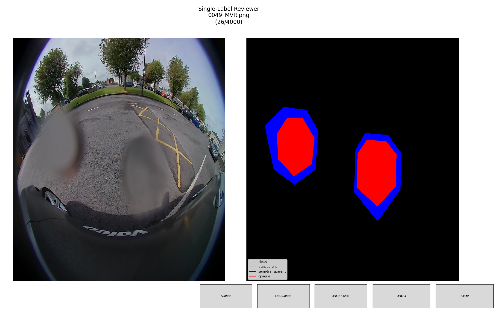
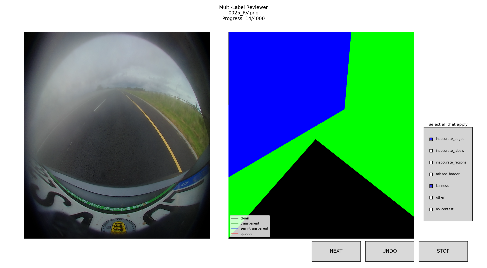
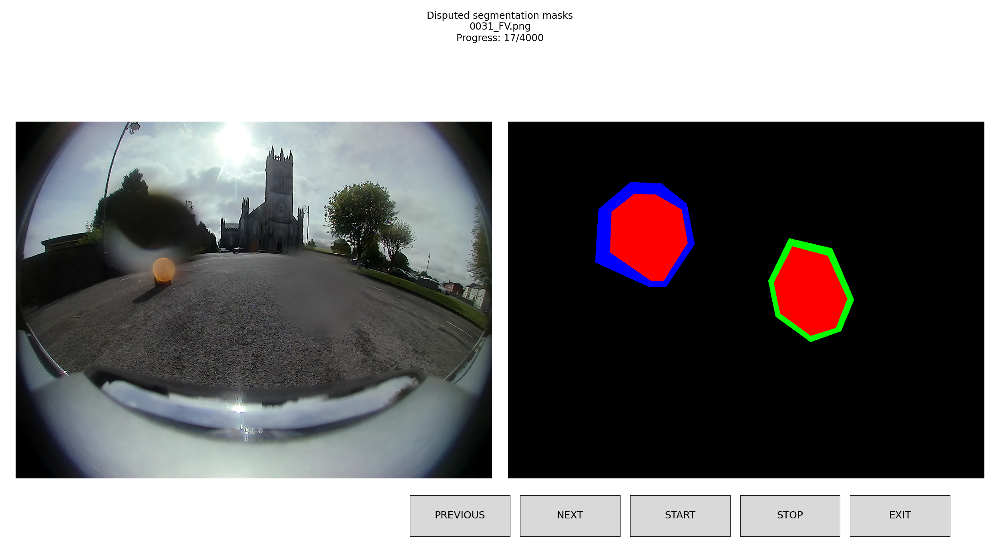

# Image Annotation Reviewer

This project provides a set of tools for efficient and structured image annotation review. It includes both single-label and multi-label reviewers, as well as a results viewer for quick review of sorted data. It provides a powerful framework for structured and efficient image annotation review, with room for expansion and improvement in the future.

The code in this project was extricated and heavily refactored from part of the codebase used in my research for data review and improvement. It was mainly written as needed to allow undergraduates without any coding experience to aid in reviewing semantic segmentation image datasets for contentious annotation choices. It can easily be extended to any groups of images

---

## Core Components

### Reviewers for Sorting
##### **BaseReviewer (`base_reviewer.py`)**
- Abstract base class managing the core review process.
- Handles image display, undo functionality, and basic navigation.

##### **SingleLabelReviewer (`unilabel_reviewer.py`)**
- Each image is assigned exactly one label using button-based selection.
- Moves automatically to the next image upon selection.
- Supports label legends for visual clarity.

##### **MultiLabelReviewer (`multilabel_reviewer.py`)**
- Supports multiple labels per image via checkboxes.
- Includes a "NEXT" button to confirm selections before advancing.
- Provides validation to ensure at least one label is chosen.

##### **ImageSorter (`sorter.py`)**
- Manages image file handling and keeps track of sorting progress.
- Integrates with `BinManager` to store classification results.
- Allows checkpointing for resuming annotation sessions.


### Reviewers for Playback
##### **SortResultsViewer (`viewer.py`)**
- Read-only tool for visually inspecting sorted images.
- Supports navigation via "NEXT" and "PREVIOUS" buttons.
- Can auto-play through images for quick review.


---

## Usage Examples

### **Single-Label Review (`mask_review.py`)**
```python
from sideeye_reviewer.core.sorter import ImageSorter
from sideeye_reviewer.core.unilabel_reviewer import SingleLabelReviewer

SORTER_LABELS = ["agree", "disagree", "uncertain"]
LEGEND_LABELS = {"clean": "black", "transparent": "green", "semi-transparent": "blue", "opaque": "red"}

sorter = ImageSorter(image_folders=["path/to/images"], out_dir="path/to/output", labels=SORTER_LABELS, json_name="review_output.json")
reviewer = SingleLabelReviewer(sorter, legend_dict=LEGEND_LABELS)
reviewer.begin_review()
```




### **Multi-Label Review (`contention_review.py`)**
```python
from sideeye_reviewer.core.sorter import ImageSorter
from sideeye_reviewer.core.multilabel_reviewer import MultiLabelReviewer

SORTER_LABELS = ["inaccurate_edges", "inaccurate_labels", "inaccurate_regions", "missed_border", "laziness", "other", "no_contest"]
CLASS_LABELS = {"clean": "black", "transparent": "green", "semi-transparent": "blue", "opaque": "red"}

sorter = ImageSorter(image_folders=["path/to/images"], out_dir="path/to/output", labels=SORTER_LABELS, json_name="review_output.json")
reviewer = MultiLabelReviewer(sorter, legend_dict=CLASS_LABELS)
reviewer.begin_review()
```




### **Results Viewer (`viewer_test.py`)**
```python
from sideeye_reviewer.core.viewer import SortResultsViewer

def show_disputed_images(file_list, img_dirs):
    viewer = SortResultsViewer(file_list, img_dirs, "Disputed Images Viewer")

show_disputed_images(["image1.jpg", "image2.jpg"], ["path/to/images"])
```



---

## Planned Extensions

### **Short-Term Improvements**
- **Keyboard Shortcuts:** Support for quick labeling via keyboard inputs.
- **Enhanced Undo History:** More granular control over undo actions (multi-step undo).
- **Arbitrary Number of Images:** Allowing more than 2 images to be displayed simultaneously.
- **Annotation Overlay Preprocessing:** Replace options for segmentation mask overlay and more general annotations.
- **Advanced Filtering Options:** Sort and filter reviewed images by label, reviewer, or confidence score.

### **Long-Term Enhancements**
- **AI-assisted Pre-labeling:** Integration with pre-trained ML models to suggest initial labels.
- **Batch Processing:** Ability to label multiple images at once, primarily through pre-defined file clustering.
- **Collaborative Review Mode:** Versioning for multiple reviewers working on the same dataset.
- **Multi-Image Comparison:** Side-by-side comparison of multiple images during review.


