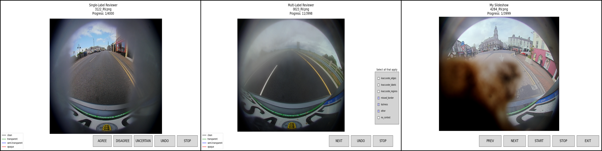

# Image Annotation Reviewer

This project provides a structured and modular framework for efficient image annotation review. It includes both single-label and multi-label reviewers, as well as a simple slideshow viewer for quick assessment of sorted data and additional image aspects/transformations as specified. The codebase follows a pseudo-MVC design pattern, enhancing modularity and maintainability while providing a basic framework for any general image data curation and review, with the groundwork laid for expansion and improvement in the future.

The project originally developed in my previous research position to aid in reviewing semantic segmentation datasets (with poor annotation quality) by undergraduates without coding experience. It can easily be extended to any grouping of images, with future enhancements planned for on-the-fly generation of new images/plots.

---

## Features
Currently, the project supports
- sorting images by selecting user-defined labels to manually sort images into labeled "bins" via an extensive `matplotlib` GUI
- simple playback of images within the slideshow viewer given the image paths

#### Sorting Examples
1. **Single Label Example** - a simple use case in which human reviewers evaluate image annotations:
```json
{
    "agree": [
        "0001_FV.png",
        "0003_FV.png",
        "0008_MVL.png",
        "0011_MVL.png",
        "0023_RV.png",
        "0045_MVL.png",
        "0047_MVL.png"
    ],
    "disagree": [
        "0015_MVR.png",
        "0017_MVR.png",
        "0025_RV.png",
        "0027_RV.png",
        "0029_RV.png",
    ],
    "uncertain": [
        "0043_MVL.png",
    ]
}
```

2. **Multilabel Example** - follow-up usage where reviewers select the reason a file was sorted as "disagree" in the previous example:
- Note that selection of "agreed", "uncertain" and the specific reason for disagreement can be done using just the multilabel review. Multiple rounds of review aren't necessary.
```json
{
    "inaccurate_edges": [],
    "inaccurate_labels": [
        "0003_FV.png"
    ],
    "inaccurate_regions": [
        "0003_FV.png",
        "0005_FV.png"
    ],
    "missed_border": [
        "0001_FV.png"
    ],
    "other": [
        "0003_FV.png"
    ],
    "no_contest": []
}
```

Note that implementation of the sorting results will likely remain this simple throughout the lifetime of the project since the simplicity is what makes it a robust solution. I am planning to write more session-related metadata to the JSON files for better checkpointing, documentation, and ease in resuming review sessions.

I'm also considering adding additional (equally simple) output file formats in the future.


## Core Architecture

The architecture of the new modular reviewer framework follows the Model–View–Controller (MVC) design pattern often used for large-scale UI applications


#### Controllers (Handling User Interactions)
1. `BaseReviewController` (base_controller.py)
   - Abstract base class managing shared logic for controllers.
   - Handles image loading, file navigation, and window events.

2. `ReviewerController` (review_controller.py)
    - **Annotation-based controller** for managing user interactions for both single-label and multi-label reviewers.
    - Controls undo functionality, label assignment, and progress tracking.

3. `SlideshowController` (slides_controller.py)
    - **Read-only controller** for displaying reviewed images in a slideshow format.
    - Supports manual bidirectional navigation and auto-play for simpler reviewing.


#### Views (UI and Figure Management)
1. `BaseReviewerView` (base_viewer.py)
    - Common UI logic for all reviewers, except for the slideshow viewer, which implements a simpler interface.
    - Handles figure and legend creation, buttons, and image display while updating the controller on user events.

2. `SingleLabelReviewerView` (unilabel_reviewer.py)
    - UI for **single-label classification**, with dedicated buttons for each label and instant responses
    - Allows for undo functionality with an arbitrary number of user-supplied image labels

3. `MultiLabelReviewerView` (multilabel_reviewer.py)
    - UI for **multi-label classification**, with checkboxes for label selection.
    - Includes a "NEXT" button to confirm checkbox selections, logging chosen labels for the current image

4. `SlideshowViewerView` (slides_viewer.py)
    - **Read-only UI** for displaying sets of images in a slideshow fashion
    - Includes navigation buttons and an optional auto-play feature


#### Models (Data Management and Processing)
1. `DataManager` (data_manager.py)
    - Centralized manager for file listing, image loading, and user-defined preprocessing.
    - Supports additional on-the-fly generation of images and plots derived from the current image(s).
    - Future support planned for remote database integration and streamed data loading.

2. Sorting Models (`BinManager`)
    - Manages label assignments for both single-label and multi-label workflows through a double-ended queue
    - Manages file handling, tracking progress, and writing results to JSON.
    - The classes are integrated for structured classification.
    - Supports checkpointing for resuming annotation sessions - will later be extended to a "session-based" workflow loaded from a config


---

## Usage Examples

### **Single-Label Review**
```python
from sideeye_reviewer.models.data_manager import DataManager
from sideeye_reviewer.controllers.review_controller import ReviewerController
from sideeye_reviewer.views.unilabel_reviewer import SingleLabelReviewerView

SORTER_LABELS = ["agree", "disagree", "uncertain"]
# NOTE: example legend labels are based on the original project intended for judging the Valeo Woodscape Soiling Dataset
LEGEND_LABELS = {"clean": "black", "transparent": "green", "semi-transparent": "blue", "opaque": "red"}

image_folders = ["path/to/images"] # or ["path/to/images1", "path/to/images2"]
out_dir = "path/to/output"
data_manager = DataManager(image_folders, out_dir, SORTER_LABELS, json_name="review_output.json", enable_sorting=True)
reviewer = SingleLabelReviewerView(legend_dict=LEGEND_LABELS)
controller = ReviewerController(data_manager, reviewer)
controller.initialize()
```


### **Multi-Label Review**
```python
from sideeye_reviewer.models.data_manager import DataManager
from sideeye_reviewer.controllers.review_controller import ReviewerController
from sideeye_reviewer.views.multilabel_reviewer import MultiLabelReviewerView

SORTER_LABELS = ["inaccurate_edges", "inaccurate_labels", "inaccurate_regions", "laziness", "other", "no_contest"]
CLASS_LABELS = {"clean": "black", "transparent": "green", "semi-transparent": "blue", "opaque": "red"}

image_folders = ["path/to/images"] # or ["path/to/images1", "path/to/images2"]
out_dir = "path/to/output"
data_manager = DataManager(image_folders, out_dir, SORTER_LABELS, json_name="review_output.json", enable_sorting=True)
reviewer = MultiLabelReviewerView(legend_dict=CLASS_LABELS)
controller = ReviewerController(data_manager, reviewer)
controller.initialize()
```


### **Slideshow Viewer**
```python
from sideeye_reviewer.models.data_manager import DataManager
from sideeye_reviewer.controllers.slides_controller import SlideshowController
from sideeye_reviewer.views.slides_viewer import SlideshowViewerView

# example function for viewer initialization
def show_disputed_images(file_list, img_dirs):
    data_manager = DataManager(image_folders=img_dirs, file_list=file_list, enable_sorting=False)
    viewer = SlideshowViewerView("Disputed Images Viewer", slide_duration=3) # 3 seconds per slide during auto-play
    controller = SlideshowController(data_manager, viewer)
    controller.initialize()

show_disputed_images(["image1.jpg", "image2.jpg"], ["path/to/images"]) # or ["path/to/images1", "path/to/images2"]
```


In all cases, single images per iteration are also supported, with plans to extend to an arbitrary number of images in the future:




---

## Planned Extensions

### **Short-Term Improvements**
- **Keyboard Shortcuts:** Support for quick labeling via keyboard inputs.
- **Enhanced Undo History:** More granular control over undo actions (multi-step undo).
- **Arbitrary Number of Images:** Allowing more than 2 images to be displayed simultaneously.
- **Annotation Overlay Preprocessing:** Enable on-the-fly creation of overlays for segmentation masks, bounding boxes, and more.
- **Advanced Filtering Options:** Sort and filter reviewed images by label, reviewer, or confidence score before review.

### **Long-Term Enhancements**
- **AI-assisted Pre-labeling:** Integration with pre-trained ML models to suggest initial labels.
- **Batch Processing:** Ability to label multiple images at once based on clustering.
- **Collaborative Review Mode:** Versioning for multiple reviewers working on the same dataset.
- **Multi-Image Comparison:** Side-by-side comparison of multiple images during review.
- **Remote Database Integration:** Extend DataManager to support remote image sources beyond disk storage.
